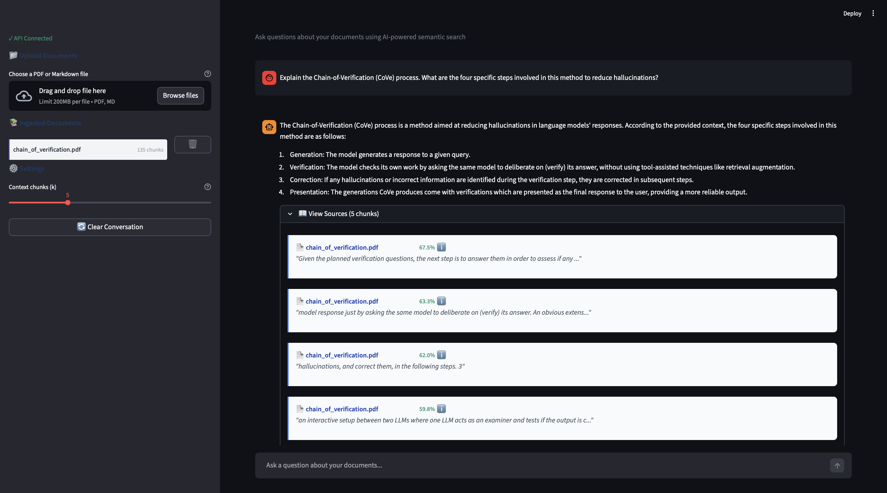

# 🏰 CITADEL — Privacy-First RAG Pipeline

**A production-grade Retrieval-Augmented Generation system that runs entirely on your infrastructure.** No data leaves your network. Built with FastAPI, pgvector, and local LLMs via Ollama.



[]()
[]()
[]()
[]()
[]()

---

## Why CITADEL?

Most RAG demos ship documents to third-party APIs. CITADEL keeps everything local — embeddings are generated on-device with `all-MiniLM-L6-v2`, vector search runs in PostgreSQL via pgvector, and LLM inference stays on your hardware through Ollama. The system gracefully degrades when the LLM is unavailable, ensuring retrieval always works even without a GPU.

---

## Key Features

| Feature | Description |
|---------|-------------|
| **Local-First Privacy** | All embeddings, vectors, and LLM inference run on your infrastructure. Zero data exfiltration. |
| **Graceful Degradation** | Ollama down? The pipeline returns retrieved context with a mock response — retrieval never breaks. |
| **Async Ingestion** | File uploads return `202 Accepted` immediately; chunking + embedding run in background tasks. |
| **SHA-256 Deduplication** | Content-hash indexing prevents duplicate ingestion at the database level. |
| **Evaluation Harness** | 17-query golden dataset with Hit Rate, MRR, category/difficulty breakdowns, and Markdown reports. |
| **Full CRUD** | Upload, list, search, ask, and delete documents — all via RESTful API. |
| **Type-Safe Codebase** | `mypy --strict` on the entire `app/` package. Pydantic v2 for all API contracts. |
| **One-Command Deploy** | `make up` spins up API, UI, PostgreSQL+pgvector, and Redis in Docker Compose. |

---

## Tech Stack

| Layer | Technology | Purpose |
|-------|-----------|---------|
| **API** | FastAPI 0.109+ | Async REST endpoints with OpenAPI docs |
| **Database** | PostgreSQL 16 + pgvector | Document storage + HNSW vector index |
| **Embeddings** | sentence-transformers (MiniLM-L6-v2) | 384-dim local embeddings, no API calls |
| **LLM** | Ollama (Mistral) | Local inference with automatic fallback |
| **Search** | pgvector cosine distance | Sub-100ms semantic similarity via HNSW |
| **Frontend** | Streamlit | Chat interface + document management |
| **ORM** | SQLAlchemy 2.0 (async) | Typed models with asyncpg driver |
| **Migrations** | Alembic | Version-controlled schema evolution |
| **CI** | GitHub Actions | Unit → Quality → Integration pipeline |

---

## Architecture

```
┌──────────────────────────────────────────────────────────┐
│                   Streamlit UI (:8501)                    │
│            Chat • Upload • Document Management           │
└─────────────────────────┬────────────────────────────────┘
                          │ HTTP/REST
┌─────────────────────────▼────────────────────────────────┐
│               FastAPI RAG Service (:8001)                 │
│                                                          │
│  POST /ingest ──→ FileProcessor ──→ TextChunker          │
│                          ──→ VectorService ──→ Repository │
│                                                          │
│  POST /ask ────→ VectorService ──→ Repository             │
│                          ──→ LLMService (Ollama)          │
│                          ──→ AskResponse + Sources        │
│                                                          │
│  POST /search ─→ VectorService ──→ Repository ──→ Results │
│  GET  /documents │ DELETE /documents/{name}               │
└─────────────────────────┬────────────────────────────────┘
                          │
          ┌───────────────┼───────────────┐
          │               │               │
  ┌───────▼───────┐ ┌────▼─────┐ ┌───────▼───────┐
  │  PostgreSQL   │ │  Ollama  │ │ MiniLM-L6-v2  │
  │  + pgvector   │ │ (Mistral)│ │  (on-device)  │
  │  HNSW index   │ │ Optional │ │  384-dim       │
  └───────────────┘ └──────────┘ └───────────────┘
```

### Data Flow: Ingestion

```
Upload (.pdf/.md)
  → SHA-256 hash check (dedup)
  → Text extraction (PyMuPDF / UTF-8)
  → Recursive chunking (500 chars, 100 overlap)
  → Batch embedding (MiniLM-L6-v2, CPU)
  → Atomic persist (document + chunks + vectors)
```

### Data Flow: Query

```
User question
  → Embed query (MiniLM-L6-v2)
  → pgvector cosine similarity (HNSW index)
  → Top-k chunks retrieved
  → Context assembled → Ollama generates answer
  → Response + source references returned
```

---

## Quick Start

### Prerequisites

- Docker & Docker Compose
- (Optional) [Ollama](https://ollama.ai) for LLM responses

### 1. Clone & Configure

```bash
git clone https://github.com/your-username/citadel.git
cd citadel
cp .env.example .env
```

### 2. Launch

```bash
make up
```

This starts: **API** (`:8001`), **UI** (`:8501`), **PostgreSQL+pgvector** (`:5432`), **Redis** (`:6379`)

### 3. Apply Database Migrations

```bash
make mig-up
```

### 4. Open the UI

Navigate to [http://localhost:8501](http://localhost:8501), upload a PDF, and start asking questions.

### 5. (Optional) Enable Full LLM Responses

```bash
ollama serve
ollama pull mistral
```

Without Ollama, CITADEL operates in **Mock Mode** — retrieval works normally, but generated answers are replaced with context previews.

---

## Development Mode

For faster iteration with hot-reload:

```bash
# Terminal 1: Start dependencies only
make deps

# Terminal 2: RAG API with auto-reload
make run-citadel

# Terminal 3: Streamlit UI
make run-ui
```

---

## Evaluation

CITADEL ships with a golden evaluation dataset (14 positive + 3 negative queries) covering ML fundamentals, algorithms, deep learning, and practical applications.

### Run Evaluation

```bash
# Seed test documents
make seed-eval

# Run evaluation harness
make eval
```

### Metrics

| Metric | Description | Target |
|--------|-------------|--------|
| **Hit Rate @k** | % of queries where the correct source appears in top-k results | ≥ 80% |
| **MRR** | Mean Reciprocal Rank — average position of the first correct result | ≥ 0.70 |
| **Negative Accuracy** | % of out-of-domain queries correctly rejected | 100% |

The harness generates both a JSON results file and a Markdown report with category-level and difficulty-level breakdowns.

### Sample Results

```
Hit Rate @1:  85.7%
Hit Rate @5:  100.0%
MRR:          0.9286
Negative Accuracy: 100%
```

---

## API Reference

| Method | Endpoint | Description |
|--------|----------|-------------|
| `POST` | `/api/v1/rag/ingest` | Upload PDF/MD for async ingestion (returns 202) |
| `POST` | `/api/v1/rag/search` | Semantic search across documents |
| `POST` | `/api/v1/rag/ask` | Full RAG: retrieve + generate answer |
| `GET` | `/api/v1/rag/documents` | List all ingested documents |
| `DELETE` | `/api/v1/rag/documents/{filename}` | Delete document + cascade chunks |
| `GET` | `/health` | Health check for orchestrators |

Full OpenAPI documentation available at [http://localhost:8001/docs](http://localhost:8001/docs) when running.

---

## Project Structure

```
citadel/
├── app/                        # CITADEL RAG application
│   ├── api/v1/rag.py           #   REST endpoints
│   ├── core/                   #   Database + config
│   ├── models/                 #   ORM (DocumentRecord, ChunkRecord)
│   ├── repositories/rag.py     #   Data access + vector search
│   ├── schemas/rag.py          #   Pydantic request/response DTOs
│   ├── services/
│   │   ├── rag_pipeline.py     #   Orchestrator (ingest → search → ask)
│   │   ├── ingestion.py        #   PDF/MD text extraction
│   │   ├── chunking.py         #   Recursive text splitting
│   │   ├── vector.py           #   Embedding generation (MiniLM)
│   │   └── llm.py              #   Ollama integration + fallback
│   └── main.py                 #   FastAPI entrypoint
├── ui/main.py                  # Streamlit frontend
├── tests/
│   ├── data/                   #   Golden dataset + sample docs
│   ├── unit/                   #   Offline unit tests
│   └── integration/            #   Docker-dependent E2E tests
├── scripts/                    # Evaluation + seeding utilities
├── migrations/                 # Alembic schema versions
├── docker-compose.yml          # Full stack orchestration
├── Makefile                    # Developer task automation
└── pyproject.toml              # Dependencies + tool config
```

---

## V2 Roadmap

- [ ] **Hybrid Search** — Combine BM25 keyword search with vector similarity (reciprocal rank fusion)
- [ ] **Multi-Model Support** — Swap between Ollama models at runtime via API parameter
- [ ] **Conversation Memory** — Multi-turn context window with sliding history
- [ ] **Reranking** — Cross-encoder reranking on top-k candidates for precision boost
- [ ] **Auth & Multi-Tenancy** — JWT-based access control with per-user document isolation
- [ ] **Observability** — OpenTelemetry traces for full pipeline latency breakdown
- [ ] **Streaming Responses** — Server-Sent Events for token-by-token LLM output
- [ ] **GPU Acceleration** — CUDA-enabled embedding inference for production throughput

---

## Contributing

1. Fork the repository
2. Create a feature branch (`git checkout -b feat/your-feature`)
3. Run quality checks (`make check`)
4. Submit a pull request

---

## License

MIT — see [LICENSE](LICENSE) for details.

---

**Author:** Youssef Chaouki
**Version:** 1.0.0
**Last Updated:** 2026-02-09
